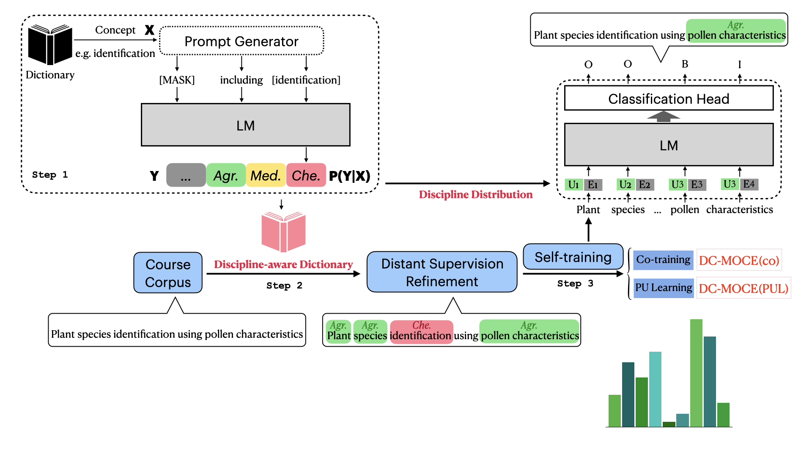

# MOOC-NER
The code and dataset of ACL'23 paper "Distantly Supervised Course Concept Extraction in MOOCs with Academic Discipline"


## Abstract

With the rapid growth of Massive Open Online Courses (MOOCs), it is expensive and time-consuming to extract high-quality knowledgeable concepts taught in the course by human effort to help learners grasp the essence of the course. In this paper, we propose to automatically extract course concepts using distant supervision to eliminate the heavy work of human annotations, which generates labels by matching them with an easily accessed dictionary. However, this matching process suffers from severe noisy and incomplete annotations because of the limited dictionary and diverse MOOCs. To tackle these challenges, we present a novel three-stage framework DS-MOCE, which leverages the power of pre-trained language models explicitly and implicitly and employs discipline-embedding models with a self-train strategy based on label generation refinement across different domains. We also provide an expert-labeled dataset spanning $20$ academic disciplines. Experimental results demonstrate the superiority of DS-MOCE over the state-of-the-art distantly supervised methods (with $7\%$ absolute F1 score improvement).



## Data Access

See [README.md](./share_data/README.md) 

## Reproduction

See [README.md](./DS-MOCE/README.md) 

## Reference

```bibtex
@artical{MOOCNER,
    title={Distantly Supervised Course Concept Extraction in MOOCs with Academic Discipline},
    author={Mengying Lu, Yuquan Wang, Jifan yu, Yexing Du, Lei Hou, Juanzi Li},
    year={2023}
}
```
